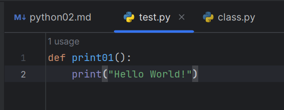

# Python基础语法(2)

## 函数

### 1.1 函数的概念

>什么是函数？

**函数**:是一个 **`被命名的`** 、独立的、**`完成特定功能的代码段`**，其可能给调用它的程序一个 **`返回值`**。

通俗地说函数就是将一段可以 **`实现某种功能`** 的代码封装起来, 想要使用这个功能就可以直接调用函数。

**`被命名的`**：在Python中，大部分函数都是有名函数。

**`完成特定功能的代码段`**：函数的功能要专一，专门为了完成某个功能而定义。

**`返回值`**：当函数执行完毕后，其可能会返回一个值给函数的调用处。

函数的主要作用：
- ① 模块化编程
- ② 代码重用

函数中的几个重要概念：

- 函数
- 参数
- 返回值

函数语法：
```text
def 函数名([参数, ..]):
    代码1
    代码2
    ...
    [return 具体的返回值]
```
- `return [表达式]` 结束函数，选择性地返回一个值给调用方。不带表达式的return相当于返回 None

### 1.2 函数定义与调用

Python函数 以 `def` 关键字开头，后接函数标识符名称和圆括号()
函数在使用时，特点：

- （1）先定义，后调用；
- （2）不调用，不执行；
- （3）调用一次，执行一次。

**实例：**
（1）编写一个show()函数，并在函数中输出内容。

（2）调用函数，观察执行结果。
```python
  # 1.定义
def show():
    print("Hello World!")

# 2.调用
show()  # 1.写对函数名;   2.()

# 扩展
def show():
    # 代码
    pass
```

### 1.2 函数的参数

[详解Python函数参数定义及传参](https://blog.csdn.net/yyykj/article/details/103122665)

当在定义函数时，设定了参数，则可称该函数为：有参函数。反之，没有参数的函数，称为：无参函数。

```text
# 定义有参数的函数
def 函数名(参数1,参数2,...):  # 形参
	代码1
    代码2
    ...
# 调用函数    
函数名(参数值1,参数值2,...)  # 实参
```

**说明：**
- （1）形参是指形式参数，表示在定义函数时的参数；

- （2）实参是指实际参数，表示在调用函数时传递的参数值，具有实际意义。

#### 必备参数
必备参数须以正确的顺序传入函数。调用时的数量必须和声明时的一样，且要关注参数的类型
```python
def printme(str,num):
    print(str,num)
    return 
printme(蓝山,666)
```
#### 关键字参数
关键字参数和函数调用关系紧密，函数调用使用关键字参数来确定传入的参数值。
使用关键字参数允许函数调用时参数的顺序与声明时不一致，因为 Python 解释器能够用参数名匹配参数值
```python
def printme(str,num):

   return
 
printme(num = 666, str = "My string")
```
#### 默认参数
调用函数时，默认参数的值如果没有传入，则被认为是默认值
````python
def printinfo( name, age = 35 ):
   "打印任何传入的字符串"
   print("Name: ", name)
   print ("Age ", age)
   return

printinfo( age=50, name="miki" )
printinfo( name="miki" )
````
#### 不定长元组参数
不定长元组参数，就是不确定数量的参数，定义一个参数把传入的参数组合成元组，来接收函数调用时传递过来的N个参数，
在函数体内以元组形式按顺序读取。
```python
def printinfo( str, *vartuple ):
   print(str)
   for var in vartuple:
      print(var)
   return

printinfo( 10 )
printinfo( 70, 60, 50 )
```
#### 匿名函数
python 使用 lambda 来创建匿名函数。
- lambda只是一个表达式，函数体比def简单很多。
- lambda的主体是一个表达式，而不是一个代码块。仅仅能在lambda表达式中封装有限的逻辑进去。
- lambda函数拥有自己的命名空间，且不能访问自有参数列表之外或全局命名空间里的参数。
- 虽然lambda函数看起来只能写一行，却不等同于C或C++的内联函数，后者的目的是调用小函数时不占用栈内存从而增加运行效率。
```python
sum = lambda arg1, arg2: arg1 + arg2
num = lambda: 666

print ("相加后的值为 : ", sum( 10, 20 ))
print(num)
# 输出形如 <function <lambda> at 0x00000249F7AD7B00> 的结果
# 这一长串复杂的十六进制数是函数num的内存地址
print(num())
# 在函数名num后面加上括号，才能正确地输出666
```
#### 全局变量和局部变量
定义在函数内部的变量拥有一个局部作用域，定义在函数外的拥有全局作用域。

局部变量只能在其被声明的函数内部访问，而全局变量可以在整个程序范围内访问。调用函数时，所有在函数内声明的变量名称都将被加入到作用域中。
```python
total = 0 # 这是一个全局变量

def sum( arg1, arg2 ):
   
   total = arg1 + arg2 # total在这里是局部变量.
   print ("函数内是局部变量 : ", total)
   return total
 
#调用sum函数
sum( 10, 20 )
print("函数外是全局变量 : ", total)
```
### 1.3 函数的返回值

函数的返回值指的是：当函数完成一件事情后，最后要返回给函数的结果。

- （1）若要给函数返回结果，需要使用return关键字；
- （2）return关键字的作用：把结果返回给函数；结束函数；
- （3）当函数没有返回值时，默认返回None。

**实例：**
```python
# 1.求解积
def get_multiply(a, b):
    ret = a * b
    return ret

print(get_multiply(10,20))   # print()
print('-'*50)

# 2.求差、和
def get_sub_sum(a, b):
    ret1 = a -b
    ret2 = a + b
    return ret1,ret2   # 元组
    
result = get_sub_sum(30,14)
print(result)
print('-'*50)

# 3.输出：(输出没有返回值)
def show():
    print("蓝山工作室")
print(show())
```

### 1.4 说明文档
说明文档指的是：在定义函数的第一行，加上多行注释。这样的操作，可以让函数更加规范化。

当添加了说明文档后，在调用函数时，就能查看到函数的作用提示。

当需要看函数的说明文档的具体内容时，语法：
```text
help(函数名)
```
### 2. 函数的嵌套调用
### 2.1 嵌套调用及执行流程
函数的嵌套调用指的是：在一个函数中，调用了另一个函数。

嵌套调用语法：
```text
def 函数1():
	代码
	...

def 函数2():
	代码
	# 调用函数1
	函数1()
	...
	# 在函数2中，调用了函数1。
```

```python
# 1.定义func()
def func():
    print("Hello World!\n")

# 2.定义test()、调用func()
def test():
    print("111")
    func()
    print("000")
    
# 3.调用test()
test() 
```

```python
# 1.定义函数
def line():
    print("-"*40)

# 2.N条横线
def print_lines(num):
    i = 0
    while i < num:
        # 嵌套调用
        line()
        i += 1

print_lines(10)
```

#### 自己编写函数

```python
def add(a: int, b: int) -> int:
    return a + b

a = int(input("a="))
b = int(input("b="))
print("a+b={}".format(add(a, b)))
```

#### 内置函数

[Python 内置函数](https://docs.python.org/zh-cn/3/library/functions.html)

## 面向对象
### 1. 什么是面向对象编程（OOP）？
**面向对象编程（Object-Oriented Programming，OOP）** 是一种程序设计范式，它以对象为中心，将数据和操作数据的方法（函数）组合到一个单元中，这个单元就是对象。每个对象都是类的一个实例，而类则定义了对象的属性（数据）和方法（代码）。换句话说，面向对象编程将现实世界中的实体抽象为程序中的对象，这些对象可以相互交互、传递消息，并且可以继承和扩展。

面向对象编程通常具有以下几个核心概念：

- **类（Class）**：定义了对象的模板，包括数据和方法。
- **对象（Object）**：类的实例，具有特定的属性和方法。
- **封装（Encapsulation）**：将数据（属性）和操作数据的方法（函数）封装到对象中，使得对象的内部细节对外部不可见。
- **继承（Inheritance）**：允许一个类（子类）继承另一个类（父类）的属性和方法，并且可以添加自己的特定属性和方法。
- **多态（Polymorphism）**：允许不同类的对象对同一个方法做出不同的响应，提高代码的灵活性和可重用性。

一个简单的例子：

假设我们要模拟一个动物园中的动物。

我们可以使用定义一个 Animal（动物）类，并创建具体的动物对象。

这就是面向对象编程的两个概念了，类、对象。
```python
# 定义 Animal（动物）类
class Animal:
    # 首先定义了一个 Animal（动物）类，它有两个属性 name（名字）和 age（年龄）
    # 在 __init__ 构造函数中，我们初始化了这两个属性。
    def __init__(self, name, age):
        self.name = name
        self.age = age
    # Animal 类有一个 make_sound（发出声音）方法，
    # 但在基类中我们只定义了方法的签名，没有具体的实现。
    # 这是因为我们无法确定所有动物的叫声，具体的叫声会在子类中实现。
    def make_sound(self):
        pass
 
# 然后我们定义了两个具体的动物类 Cat（猫）和 Dog（狗），它们都继承自 Animal 类。
# 这意味着 Cat 和 Dog 类会继承 Animal 类的属性和方法，并且可以根据需要添加自己的属性和方法
# 在 Cat 类和 Dog 类中，我们重写了 make_sound 方法，分别返回了猫和狗的叫声
class Cat(Animal):
    def make_sound(self):
        return "Meow"
 
class Dog(Animal):
    def make_sound(self):
        return "Woof"
 
# 最后，我们创建了两个具体的动物对象 cat1 和 dog1，分别是一只名叫 "Kitty" 的猫和一只名叫 "Buddy" 的狗
cat1 = Cat("Kitty", 3)
dog1 = Dog("Buddy", 5)
 
# 我们调用了这两个动物对象的 make_sound 方法，并打印出它们的名字和叫声
print(cat1.name, "says:", cat1.make_sound())  # 输出：Kitty says: Meow
print(dog1.name, "says:", dog1.make_sound())  # 输出：Buddy says: Woof
```
### 类和对象的关系
在这个例子中，Animal 是一个基类（父类），它定义了动物的基本属性和方法。然后，Dog 和 Cat 是 Animal 类的子类（也可以称为派生类），它们继承了 Animal 类的属性和方法，并且还可以定义自己独特的属性和方法。

当我们创建 my_dog 和 my_cat 时，实际上是在内存中实例化了两个对象，每个对象都有自己的 name 和 age 属性，并且可以调用 make_sound() 方法。

- 类是对对象的抽象，它定义了对象的属性和方法。
- 对象是类的实例，它具体化了类的定义，并可以执行类中定义的操作。
- 类和对象之间的关系就像是模具和制造出的产品之间的关系：模具定义了产品的形状和特性，而产品则是模具的具体实例。

```python
class Car:
    num_cars = 0  # 类属性
 
    def __init__(self, make, model, year):
        self.make = make
        self.model = model
        self.year = year
        Car.num_cars += 1  # 每创建一个实例，num_cars 加一
```
- **实例属性：** 实例属性是指属于特定实例的属性。它们在创建实例时被赋予，并且每个实例都可以有不同的值。 通常在类的__init__方法中初始化。
- **类属性：** 属于类本身的属性，被所有类的实例共享。可以直接在类定义中设置

```python
class Car:
    def __init__(self, brand):
        self.brand = brand
        self.speed = 0
 
    def accelerate(self, amount):
        self.speed += amount
 
    def brake(self, amount):
        self.speed -= amount
 
car1 = Car("Toyota")
print(car1.speed)  # 输出: 0
car1.accelerate(50)
print(car1.speed)  # 输出: 50
car1.brake(20)
print(car1.speed)  # 输出: 30
```
- **实例方法：** 操作实例属性的方法，第一个参数通常是 self，代表对象本身。可以访问实例属性，并且可以改变实例的状态。

```python
class Dog:
    num_of_dogs = 0
 
    def __init__(self, name):
        self.name = name
        Dog.num_of_dogs += 1
 
    @classmethod
    def get_num_of_dogs(cls):
        return cls.num_of_dogs
 
dog1 = Dog("Buddy")
dog2 = Dog("Max")
print(Dog.get_num_of_dogs())  # 输出: 2
```
- **类方法：** 操作类属性的方法，使用 @classmethod 装饰器定义，第一个参数通常是 cls，代表类本身。可以访问类属性，并且可以在整个类上执行操作。

```python
class Math:
    @staticmethod
    def add(x, y):
        return x + y
# add 就是 Math 类的静态方法，提供关于类的一般信息 
result = Math.add(5, 10)
print(result)  # 输出: 15
```
- **静态方法：** 不操作实例属性或类属性的方法，使用 @staticmethod 装饰器定义。它们与类无关，不传递 self 或 cls 参数。可以在类中定义，但是不能访问 self 或 cls。

### 封装
**封装是指将数据（属性）和操作数据的方法（方法）捆绑在一起的机制。** 在封装中，对象的内部细节被隐藏起来，只有特定的方法才能访问和操作这些细节。这有助于确保数据的安全性和代码的可维护性

### 如何实现封装？
封装可以通过访问控制和访问修饰符来实现。主要有两种访问修饰符：公有属性和方法、私有属性和方法。

#### 公有属性和方法 (Public Attributes and Methods)
可以被类的外部访问。在 Python 中，默认情况下，类的所有属性和方法都是公有的
```python
class Person:
    def __init__(self, name, age):
        self.name = name   # 公有属性
        self.age = age     # 公有属性
 
    def get_name(self):
        return self.name   # 公有方法
 
# 使用公有属性和方法
person1 = Person("Tiyong", 30)
print(person1.name)  # 输出: Tiyong
print(person1.get_name())  # 输出: Tiyong
```
在这个例子中，Person类有一个公有方法 get_name()，那么其他类或代码可以通过调用这个方法来获取对象的名称。

同样，有一个公有属性 age，那么其他类或代码可以直接访问和修改这个属性。**所以，我们的实例对象就可以访问公共的属性和方法。**

#### 私有属性和方法 (Private Attributes and Methods)
只能在类的内部访问，外部无法直接访问。在 Python 中，可以在属性名或方法名前加上双下划线 ‘__’ 来定义私有属性和方法
```python
class Person:
    def __init__(self, name, age):
        self.__name = name   # 私有属性
        self.__age = age     # 私有属性
 
    def __display_info(self):
        return f"Name: {self.__name}, Age: {self.__age}"   # 私有方法
 
# 外部无法直接访问私有属性和方法
person1 = Person("TiYong", 25)
# print(person1.__name)  # 这会引发错误，因为__name是私有属性
# print(person1.__display_info())  # 这会引发错误，因为__display_info()是私有方法
```
在上面的例子中：person1对象就不能访问__name私有属性和__display_info()私有方法。

尽管外部无法直接访问私有属性和方法，但我们仍然可以通过公有方法来间接访问和操作它们。

这种间接访问的方式使得我们可以控制对象的状态和行为，确保数据的一致性和安全性
```python
class Person:
    def __init__(self, name, age):
        self.__name = name   # 私有属性
        self.__age = age     # 私有属性
 
    def get_name(self):
        return self.__name   # 公有方法
 
    def set_name(self, new_name):
        self.__name = new_name   # 公有方法，用于修改私有属性
 
    def display_info(self):
        return f"Name: {self.__name}, Age: {self.__age}"   # 公有方法
 
# 通过公有方法访问和修改私有属性
person1 = Person("TiYong", 30)
print(person1.get_name())  # 输出: TiYong
person1.set_name("Toy")
print(person1.display_info())  # 输出: Name: Toy, Age: 30
```
### 继承（Inheritance）
继承就是允许一个类（称为子类或派生类）继承另一个类（称为父类或基类）的属性和方法。

子类可以继承父类的特性，并且可以在此基础上添加自己的**新特性**。这种机制允许代码的重用和层次化的设计。 继承，就是字面上意思，继承
- 继承允许子类重用父类的代码，避免了重复编写相同的代码片段。子类可以直接使用父类已经定义的方法和属性
- 子类可以在不修改父类的情况下，添加新的属性和方法，从而使得代码更具可扩展性。这样可以在不影响父类的基础上，为程序添加新的功能
#### 单继承
单继承是指一个子类只能继承一个父类的属性和方法。这是最简单和最常见的继承类型
```python
class ParentClass:
    def parent_method(self):
        print("Parent method")
 
class ChildClass(ParentClass):
    def child_method(self):
        print("Child method")
 
# 子类继承父类的方法
child = ChildClass()
child.parent_method()  # 输出: Parent method
child.child_method()   # 输出: Child method
```
#### 多继承
多继承是指一个子类可以同时继承多个父类的属性和方法。这使得子类可以具有多个父类的特性，但也可能引发一些复杂性和歧义
```python
class ParentClass1:
    def method1(self):
        print("Method 1 from ParentClass1")
 
class ParentClass2:
    def method2(self):
        print("Method 2 from ParentClass2")
 
class ChildClass(ParentClass1, ParentClass2):
    def child_method(self):
        print("Child method")
 
# 子类继承多个父类的方法
child = ChildClass()
child.method1()  # 输出: Method 1 from ParentClass1
child.method2()  # 输出: Method 2 from ParentClass2
child.child_method()  # 输出: Child method
```
### 多态（Polymorphism）

**多态**是指允许对象在不同的情况下表现出不同的行为。简单地说，多态性意味着相同的方法调用可能会有不同的实现方式，具体取决于调用该方法的对象的类型或类的实现

#### 方法重写（Method Overriding）
方法重写是实现多态的一种方式，它允许子类覆盖（重写）父类的方法，以便在子类中实现特定的行为。当子类重新定义了**与父类同名的方法**时，调用这个方法时会执行子类的实现。通过一个例子展示方法重写：
```python
class Animal:
    def speak(self):
        raise NotImplementedError("Subclass must implement abstract method")
 
class Dog(Animal):
    def speak(self):
        return "Woof!"
 
class Cat(Animal):
    def speak(self):
        return "Meow!"
 
# 多态性的体现
def animal_sound(animal):
    return animal.speak()
 
dog = Dog()
cat = Cat()
 
print(animal_sound(dog))  # 输出: Woof!
print(animal_sound(cat))  # 输出: Meow!
```
#### 方法重载（Method Overloading）
方法重载是一种在同一个类中，方法名称相同但参数列表不同的技术。但是，在Python中，并没有像其他编程语言那样直接支持方法重载的特性，不过，可以通过一些技巧来模拟。

比如：使用默认参数值或者 *args 和 **kwargs 参数来实现类似方法重载的效果。
```python
class Calculator:
    def add(self, a, b):
        return a + b
 
    def add(self, a, b, c):
        return a + b + c
 
calc = Calculator()
print(calc.add(2, 3))    # 输出: TypeError: add() missing 1 required positional argument: 'c'
print(calc.add(2, 3, 4))  # 输出: 9
```
[Python 面向对象编程(详解 + 实战)](https://blog.csdn.net/low5252/article/details/108944057#:~:text=%E8%BF%99%E7%AF%87%E6%96%87%E7%AB%A0%E4%B8%BB%E8%A6%81%E4%BB%8B%E7%BB%8D%E4%BA%86P)
## 模块

### 1，什么是模块
在 Python 中，模块是一种组织 Python 代码的方法。 **模块可以包含定义（例如类、函数和变量）和可执行代码。** 

如果当我们要使用的功能在模块中时，我们就可以导入模块，使用模块中的相应功能。

也就是说：模块可以帮助你将代码组织得更有逻辑，并允许你将代码划分为更小的、更可管理的部分。

例如，我们想实现一些与时间相关的功能，我们就可以直接导入python中现有的time模块，然后调用time模块的功能帮我们实现。

### 2.模块的导入和使用
模块的导入一般写在文件的开头（这一点和C语言中，要包含对应的头文件类似，要写在开头）
导入的语法如下：
```text
 import 模块名 (可以一次导入多个模块，模块名之间用逗号隔开)
 from 模块名 import 类、变量、方法等
 from 模块名 import *
 import 模块名 as 别名
 from 模块名 import 功能名 as 别名
```
```python
import time  # 导入time模块
time.sleep(10)  # 通过 . 操作符使用功能

from time import sleep
from time import sleep  # 导入time模块的sleep功能
sleep(10)  # 直接使用功能

from time import sleep as al  # 导入time模块的sleep功能,给sleep设置别名：sl
al(10)  # 通过别名al来使用sleep功能
```
### 三，自定义模块
自定义模块其实就是创建一个以 **`.py`** 结尾的python文件，然后我们可以在这个文件里面写功能

（注意：自定义模块的命名要符合标识符的命名规则）

当我们需要调用这个文件里面的功能时，只需要导入这个模块就可以（模块名就是文件名）

例如，我们创建一个自定义模块:



使用它：
```python
import test  # 导入我们的自定义模块
test.ptint1()  # 使用里面的功能
```

2，同名功能的选择
注意：当导入多个不同的模块，但模块内有同名功能，当调用这个同名功能时，*调用的是后面导入的模块的功能*

3，**`*`** 和 **`__all__`**

在Python中，使用 **`from module_name import * `** 表示导入模块中的所有内容。

这会导入模块中的所有变量、函数和类，我们可以在当前命名空间中直接使用它们。

（注意：这种方法可以快速地导入模块中的所有内容，但可能导致命名冲突，因此通常不推荐使用）
***
**`__all__ `** 是模块中的一个特殊变量，它定义了模块中应该被导入的内容。

在Python中，**`__main__`** 是一个特殊的模块，它主要用于执行模块中的main()函数。

当你直接运行一个Python文件时，这个文件中的代码会进入 **`__main__`** 模块。

换句话说，**`__main__`** 模块是Python解释器直接运行的入口。

在Python中，一个模块的 **`__name__`** 属性会自动设置为 **`__main__`**，

如果你直接运行一个模块，你可以通过这个属性来判断当前的模块是否是 **`__main__`** 模块。

当我们运行这条代码所写在的文件的时候：**`__name__`** 就会直接被设置成 **`__main__`**

当我们运行别的文件的时候，**`__name__`** 是不会被设置成 **`__main__`** 的

[_all_的详细使用](https://blog.csdn.net/weixin_41738417/article/details/102961903)

### 调用其他.py文件的函数
在写代码的时候，我们要面临的将代码清晰化，主文件的函数较为简洁，于是我们便要掌握如何调用其他.py文件的代码。

如果A.py文件与B.py文件在同一个文件夹下：(A.py调用B.py的函数或者类)

B.py的函数：
```python
def add(x,y):
    z=x+y
    return z
```

A.py文件调用函数:
```python
from B import add
sum=add(4,5)
```
```python
import B
sum=B.add(4,5)
```
B.py中存在类：
```python
class sum():
        def __init__(self,x,y):
            self.x=x
            self.y=y
        def add(self):
            sum=self.x+self.y
            return sum
```
A.py文件调用类
```python
from B import sum
get_sum=sum(4,5)
value=get_sum.add()
```
```python
import B
get_sum=B.sum(4,5)
value=get_sum.add()
```
如果A.py文件与B.py文件不在同一个文件夹下：(A.py调用B.py的函数或者类)

则只需要在加载文件之前加载路径
```python
import sys
sys.path.append('.py文件的文件夹位置')
from B import sum
get_sum=sum(4,5)
value=get_sum.add()
```
在加载.py文件时经常会遇到 no module name，遇到该问题的时候我们要确定文件的路径是否错误

#### 导入模块中的函数

[Python 标准库](https://docs.python.org/zh-cn/3/library/index.html)

```python
import math


print(math.floor(32.9))
```

```python
from datetime import datetime

print(datetime.now())
```

## 文件处理

在 Python 编程中，文件操作是一项基础且重要的技能，无论是数据分析、网络编程还是自动化脚本，都离不开对文件的读写操作。

### 文件打开 ———— `open` 函数
在 Python 中，使用内置的 `open` 函数来打开文件。`open` 函数的基本语法如下：
```python
file_object = open(file_name, mode)
```
完整的语法格式为：
```python
open(file, mode='r', buffering=-1, encoding=None, errors=None, newline=None, closefd=True, opener=None)
```
参数说明:

- file: 必需，文件路径（相对或者绝对路径）。
- mode: 可选，文件打开模式
- buffering: 设置缓冲
- encoding: 一般使用utf8
- errors: 报错级别
- newline: 区分换行符
- closefd: 传入的file参数类型
- opener: 设置自定义开启器，开启器的返回值必须是一个打开的文件描述符。
- 
- **file_name：** 文件的路径和名称。
- **mode：** 打开文件的模式。常用模式包括 `'r'`（只读），`'w'`（只写），`'a'`（追加），`'r+'`（读写），`'b'`（二进制模式）。
当使用 Python 的 open 函数打开文件时，mode 参数定义了文件应该以什么模式打开。不同的模式决定了文件如何被读取或写入。以下是 mode 参数的不同选项及其描述：

| 模式     |                        	描述                        |
|--------|:-------------------------------------------------:|
| `'r'`  |             只读模式。如果文件不存在，会发生异常。这是默认模式             |
| `'w'`  |          只写模式。如果文件存在，将被覆盖。如果文件不存在，创建新文件           |
| `'a'`  |     追加模式。如果文件存在，写入的数据将被追加到文件末尾。如果文件不存在，创建新文件      |
| `'+'`  |             打开一个文件进行更新(可读可写)            |
| `'r+'` |           读写模式。可以读取和写入文件。如果文件不存在，会发生异常            |
| `'w+'` |          读写模式。如果文件存在，将被覆盖。如果文件不存在，创建新文件           |
| `'a+'` |     读写模式。如果文件存在，写入的数据将被追加到文件末尾。如果文件不存在，创建新文件      |
| `'x'`  |       独占写模式。如果文件已存在，操作将失败。只有在创建新文件时才使用这种模式        |
| `'b'`  |二进制模式。用于非文本文件如图像或二进制数据。可以与其他模式结合使用(如 `'rb'` 或 `'wb'`) |
| `'t'`  |文本模式（默认）。用于文本文件处理。可以与其他模式结合使用(如 `'rt'` 或 `'wt'`)|

可以根据需要选择适合的模式来打开文件。

例如，如果需要读取文件的内容，应该使用 `'r'` 模式。

如果想写入内容到一个新文件，并且不希望覆盖已有的文件，应该使用 `'x'` 模式。

如果打算处理二进制数据，如图片或者视频文件，应该选择 `'b'` 模式。

### 3 文件读取
### 3.1 读取整个文件
使用 `read()` 方法可以一次性读取整个文件内容
```python
with open('example.txt', 'r') as file:
    content = file.read()
    print(content)
```
### 3.2 按行读取
使用 `readline()` 或 `readlines()` 方法可以按行读取文件内容
```python
# 使用 readline()
with open('example.txt', 'r') as file:
    line = file.readline()
    while line:
        print(line, end='')
        line = file.readline()

# 使用 readlines()
# Hello, this is line 1.   
# This is line 2.   
# And this is line 3. 
with open('file.txt', 'r') as file:
    line1 = file.readline()
    line2 = file.readline()
    line3 = file.readline()

print(line1)  # 输出：Hello, this is line 1.
print(line2)  # 输出：This is line 2.
print(line3)  # 输出：And this is line 3.

# 文件迭代器
# 文件对象是可迭代的，因此我们可以使用for循环逐行读取文件内容
with open('example.txt', 'r') as file:
    lines = file.readlines()
    for line in lines:
        print(line, end='')
```
- `readlines` 方法用于读取文件的**所有行**，并将每一行作为一个字符串存储在列表 lines 中

  适用于处理包含多行文本的文件，可以一次性将整个文件加载到内存中。这种方法适用于文件较小，可以完全装入内存的情况
- `readline` 方法用于读取文件的**一行**，并将该行作为一个字符串存储在变量 line 中,每个 `readline`调用都会读取文件的下一行
  适用于逐行处理大型文件，可以有效地降低内存使用。因为它一次只读取一行，可以在循环中逐行处理文件，而不必将整个文件加载到内存中
- `with open(...) as file` : 是使用**上下文管理器**的方式，确保文件在使用后被正确关闭，即使在处理文件时发生异常也能保证关闭。
### 4 文件写入
### 4.1 写入文本
使用 `write()` 方法可以将文本写入文件：
```python
with open('example.txt', 'w') as file:
    file.write("Hello, Python!\n")
```
### 4.2 写入多行
使用 `writelines()` 方法可以一次性写入多行：
```python
lines = ["First line\n", "Second line\n"]
with open('example.txt', 'w') as file:
    file.writelines(lines)
```
### 4.3 文件关闭
在 Python 中，使用 `with` 语句打开文件是最佳实践，因为它会确保文件在操作完成后自动关闭。

如果使用传统的 `open()` 和 `close()` 方法，务必不要忘记调用 `close()` 来关闭文件，以避免资源泄漏。
```python
file = open('example.txt', 'r')
# 进行文件操作
file.close()
```
[Python超详细基础文件操作（详解版）](https://blog.csdn.net/z_ipython/article/details/135587034#:~:text=Python%E6%8F%90%E4%BE%9B%E4%BA%86%E4%B8%B0)

[Python文件操作，看这篇就足够](https://zhuanlan.zhihu.com/p/56909212)

### 异常基础

#### python标准异常
| 异常名称  |               	描述                |
|-------|:--------------------------------:|
| SyntaxError | 语法错误。由于代码书写不规范导致的。例如，括号不匹配、缺少冒号等 |
| NameError |         尝试访问未定义的变量或函数时引发         |
| TypeError |         使用不兼容的类型进行操作时引发          |
| ZeroDivisionError |          尝试除以(或取模)零时引发           |
| FileNotFoundError |          尝试打开不存在的文件时引发           |
| IndexError |       尝试访问列表或序列中不存在的索引时引发        |
| FileNotFoundError |          尝试打开不存在的文件时引发           |

在Python中，异常是一种特殊的对象，用于处理程序运行过程中发生的错误情况。

当Python解释器检测到一个错误，它会抛出（raise）一个异常。

如果这个异常没有被捕获（catch），程序就会终止并显示一个错误消息，即跟踪回溯（traceback）。

通过使用**try…except**语句块，我们可以捕获异常并采取适当措施,其基本语法如下：
```python
try:
    # 可能触发异常的代码
except ExceptionType:
    # 处理异常的代码
```
当try子句中的代码触发异常时，程序将跳转到与该异常类型匹配的except子句，并执行相应的处理代码。

如果try子句中的代码没有触发异常，except子句将被忽略。

一个try语句可以有多个except子句，用于处理不同类型的异常。

此外，还可以使用一个不带异常类型的except子句来捕获所有异常，但这通常不推荐，因为它会隐藏程序中的逻辑错误
```python
try:
    # 可能触发异常的代码
except ValueError:
    # 处理ValueError异常的代码
except ZeroDivisionError:
    # 处理ZeroDivisionError异常的代码
except Exception as e:
    # 处理其他所有异常的代码
    print("An error occurred:", e)

```

**`try-except-else`语句**
try-except语句还可以包含一个else子句，用于在try子句中的代码没有触发异常时执行
```python
try:
    # 可能触发异常的代码
except ExceptionType:
    # 处理异常的代码
else:
    # 如果没有异常发生，执行这里的代码
    print("Everything went fine")
```

**`try-finally`语句**
try-finally语句用于确保无论是否发生异常，某些代码都会被执行，例如释放资源或关闭文件等
```python
try:
    # 可能触发异常的代码
except ExceptionType:
    # 处理异常的代码
finally:
    # 无论是否发生异常，都会执行的代码
	print("This code will always run")
```
**核心特性和优势:**
- **增强程序健壮性：** 通过预测和处理潜在错误，确保程序不会意外终止。
- **提高代码可读性：** 明确地指出哪些部分代码可能会出错，并给出处理方案。
- **模块化错误处理：** 允许在不同层级捕获和处理异常，使得错误处理逻辑更加集中和模块化。

### 三、技术细节
**异常层次结构**

Python中的异常类形成了一个层次结构，位于BaseException之下，

常见的如Exception、ValueError等。了解这一结构有助于精准地捕获特定类型的异常。

**自定义异常**

开发者可以自定义异常类，应直接或间接继承自内置的Exception类，以更好地表达特定业务逻辑中的错误情况。
```python
class MyCustomError(Exception):
    pass

def functionName( level ):
    if level < 1:
        raise Exception("Invalid level!", level) # # 这里使用raise语句自己触发异常
        # 触发异常后，后面的代码就不会再执行 
try:
    functionName(0)
except MyCustomError as e:
    print(e)
```

### 应用场景：文件操作
文件读取时，可能遇到文件不存在、权限不足等多种错误，合理使用异常处理可以优雅地应对这些问题。
```python
try:
    with open("example.txt", 'r') as file:
        content = file.read()
except FileNotFoundError:
    print("文件未找到，请检查路径是否正确。")
except PermissionError:
    print("没有足够的权限访问文件。")
else:
    print(content)
finally:
    print("文件操作完成，无论是否成功都会执行此段代码。")
```
