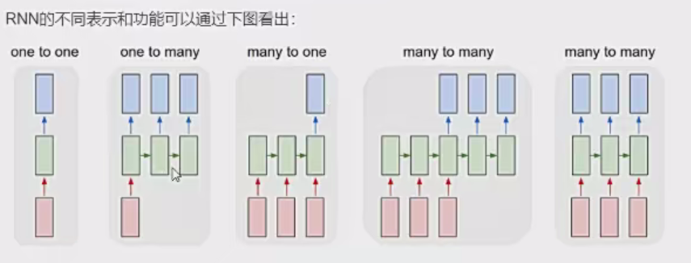
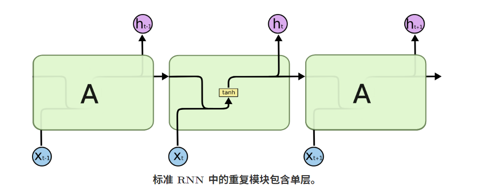
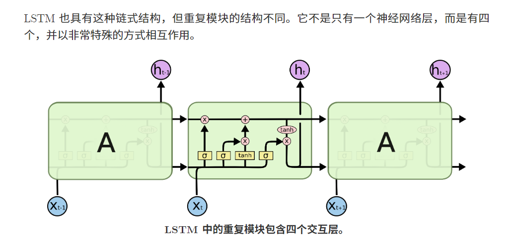
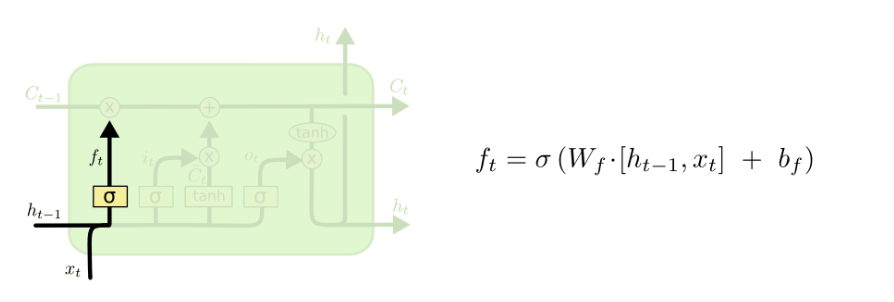
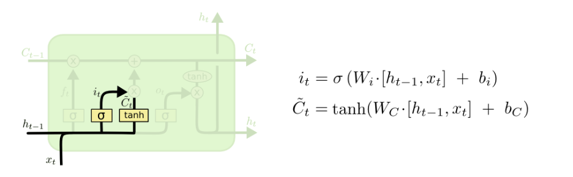
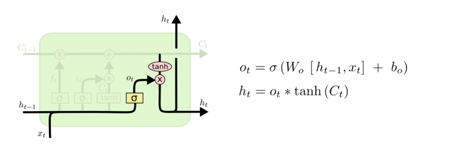

# 一、背景介绍

## 1.深度学习在自然语言处理中的应用

自然语言处理是教会机器如何去处理或者读懂人类语言的系统，主要应用领域：

+ 对话系统 - 聊天机器人（小冰）
+   情感分析 - 对一段文本进行情感识别（我们一会要做的）
+   图文映射 - CNN和RNN的融合
+  机器翻译 - 将一种语言翻译成另一种语言，现在谷歌做的太牛了
+ 语音识别 - 能不能应用到游戏上，王者荣耀摁的手疼

## **2.词向量模型**

计算机可只认识数字！

我们可以将一句话中的每一个词都转换成一个向量

你可以将输入数据看成是一个 16*D 的一个矩阵。

### **Word2Vec**

词向量是具有空间意义的并不是简单的映射！例如，我们希望单词 “love” 和 “adore” 这两个词在向量空间中是有一定的相关性的，因为他们有类似的定义，他们都在类似的上下文中使用。单词的向量表示也被称之为词嵌入。

为了去得到这些词嵌入，我们使用一个非常厉害的模型 “Word2Vec”。简单的说，这个模型根据上下文的语境来推断出每个词的词向量。如果两个个词在上下文的语境中，可以被互相替换，那么这两个词的距离就非常近。在自然语言中，上下文的语境对分析词语的意义是非常重要的。比如，之前我们提到的 “adore” 和 “love” 这两个词，我们观察如下上下文的语境。

这个嵌入矩阵包含训练集中每个词的一个向量。传统来讲，这个嵌入矩阵中的词向量数据会很大。

Word2Vec 模型根据数据集中的每个句子进行训练，并且以一个固定窗口在句子上进行滑动，根据句子的上下文来预测固定窗口中间那个词的向量。然后根据一个损失函数和优化方法，来对这个模型进行训练。

# 二、循环神经网络（RNN）基本原理

## 1.概念和作用

+ 时间步：timestep，不同时刻（把输入展开，每个输入
  是一个不同的时间步上的）
+ 循环：下一个实践步上，输入不就有当前时间步的输
  入，还有上一个时间步的输出
+ RNN：具有短期记忆的网络结构。把之前的输出作为
  下一个时间步的输入

## 2.RNN类型

+ one-to-one:图像分类
+ one-to-many:图像转文字 
+ many-to-one:文本分类
+ 异步的many-to-many：文本翻译 
+ 同步many-to-many：视频分类 

## 3.LSTM

###  遗忘门 

### 输入门

### 输出门

# 三、RNN实现情感文本分类

**目标:**

+ 知道LSTM和GRU的使用方法及输入输出的格式 
+ 能够应用LSTM和GRU实现文本情感分类

## 1. Pytorch中LSTM和GRU模块使用 

### 1.1LSTM介绍

LSTM和GRU都是由torch.nn提供

通过观察文档，可知LSMT的参数，

**torch.nn.LSTM(input_size, hidden_size, num_1ayers, batch_first, dropout, bidirectional)**

1. input_size：输入数据的形状，即embedding_dim
2. hidden_size：隐藏层的数量，即每一层有多少个LSTM单元 
3. num_1ayer：即RNN的中LSTM单元的层数
4. batch_first：默认值为False，输入的数据需要[seq_len，batch，feature]，如果为 True，则为[batch,seq_len,feature]
5. dropout：dropout的比例，默认值为0。dropout是一种训练过程中让部分参数随机失活的一种方式，能够提高训练速度，同时能够解决过拟合的问题。这里是在LSTM的最后一层，对每个输出进行dropout
6. bidirectional：是否使用双向LSTM，默认是False

实例化LSTM对象之后，**不仅需要传入数据，还需要前一次的h_O（前一次的隐藏状态）和c_0（前一次memory)**

即：lstm（input,（h_0,c_0）)
LSTM的默认输出为output，（h_n，c_n）

1. output:（seq_len,batch,num_directions*hidden_size) 
2. h_n:（num_layers * num_directions,batch，hidden_size) 
3. c_n:(num_1ayers * num_directions,batch,hidden_size)

> hidden_size表示其中lstm的单元数量

### 1.2 LSTM使用示例

假设数据输入为input，形状是[10，20]，假设embedding的形状是[100，30] 则LSTM使用示例如下：

~~~python
batch_size =10 
seq_len=20
embedding_dim=30 
word_vocab=100 
hidden_size = 18
num_1ayer=1
#准备输入数据
input = torch.randint(1ow=0,high=100,size=(batch_size,seq_1en))
#准备embedding
embedding=torch.nn.Embedding(word_vocab,embedding_dim) 
embed =embedding（input） #[10,20,30]
1stm = torch.nn.LSTM(embedding_dim,hidden_size,num_1ayer)
#把embedding之后的数据传入Lstm
1stm =nn.LSTM(input_size=embedding_dim,hidden_size=hidden_size,num_layers=num_layer,batch_first=True) output,（h_n,c_n)=1stm(input_embeded)

print(output) #[10,20,18]
print("="*10)
print(h_n) #[1*1,10,18]
print("="*10)
print(c_n)  #[1,10,18]

# 通过前面的学习，我们知道，最后一次的h_1应该和output的最后一个timestep的输出是一样的通过下面的代码，我们来验证一下：
# 取最后一个时间步上的输出
last_output=output[:,-1,:]
#获取最后一次的hidden_state
last_hidden_state =h_n[-1,:,:]
print(last_output == last_hidden_state)
~~~

### 1.3 模型的损失函数

我们把softmax概率传入对数似然损失得到的损失函数称为**交叉熵损失**

在pytorch中有两种方法实现交叉熵损失

~~~
criterion =nn.CrossEntropyLossO loss = criterion（input,target)
~~~

~~~
#1.对输出值计算softmax和取对数
output=F.1og_softmax(x,dim=-1)#2.使用torch中带权损失
1oss =F.nl1_loss（output,target)
~~~

### 1.4 LSTM和GRU的使用注意点

1. 第一次调用之前，需要初始化隐藏状态，如果不初始化，默认创建全为0的隐藏状态
2. 往往会使用LSTMorGRU的输出的最后一维的结果，来代表LSTM、GRU对文本处理的结果，其形状为[batch，hidden_size]。
   1. 并不是所有模型都会使用最后一维的结果
   2. 如果实例化LSTM的过程中，batch_first=False,则output[-1]or output[-1，:,：]可以获取最后一维
   3. 3.如果实例化LSTM的过程中，batch_first=True,则output[：，-i，：]可以获取最后一维 
3. 如果结果是（seq_1en，batch_size，num_directionshidden_size），需要把它转化为（batch_size，seq_1en，num_directions*hidden_size）的形状，不能够不是view等变形的方法，需要使用output.permute（1，0，2），即交换0和1轴，实现上述效果*
4. 使用双向LSTM的时候，往往会分别使用每个方向最后一次的output，作为当前数据经过双向 LSTM的结果
   + 即:torch.cat（[h_1[-2,:,:],h_1[-1,:,:]],dim=-1)
   + 最后的表示的size是[batch_size，hidden_size*2] 
5. 上述内容在GRU中同理

~~~
#获取双向LSTM中正向的最后一个时间步的output
Last_output=output[:,-1,:18]
#反向
last_output=output[:,0,18:]
#获取双向LSTM中正向的最后一个hidden_state#Last_hidden_state =h_n[-2,:,:]
~~~

### 1.5  模型的训练

[LSTM情感分析](./LSTM情感分析/LSTM.ipynb)